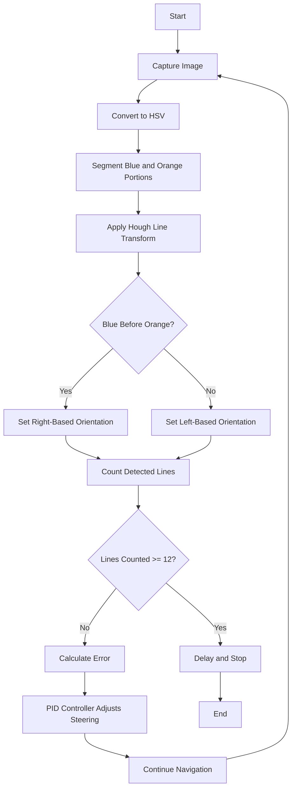
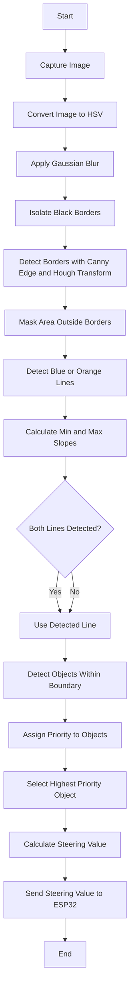

# 🤖 **MAYERDOA Robotics - WRO 2024 Project** 🤖

  

---

## 👥 **Team MAYERDOA - "Mothers' Prayers"**

- **Anas Bin Azim**  – Software & Hardware Developer | [anas.azim.71@gmail.com](mailto:anas.azim.71@gmail.com)
- **Rakibul Islam**  – Team Leader, Primary Hardware Developer | [rakibul.rir06@gmail.com](mailto:rakibul.rir06@gmail.com)
- **Mohiuddin Sami** – Primary Software Developer | [sm.mohiuddin.sami@gmail.com](mailto:sm.mohiuddin.sami@gmail.com)

**Team Origin**: Bangladesh

---

### 🌟 **The Meaning Behind MAYERDOA**

Our team name, **"MAYERDOA,"** translates to **"Mother's Prayers"** in Bengali, a tribute to the unwavering support of our mothers. They have been our guiding light, steadfastly cheering us on from the initial selection to the WRO global stage. Through every challenge, they are our invisible strength—their love and prayers fueling each achievement, each step forward, each line of code. Their blessings are woven into the fabric of this project, making it more than just a technical endeavor; it’s a heartfelt journey.

---

## 🎉 Project Overview

This repository includes all files, designs, and code for **SMOKI**, our WRO 2024 robot. Below is the folder structure:

## 📂 Structure
Here’s a breakdown of the project folders:

- **`models`**: Contains 3D models and CAD designs.
- **`others`**: Additional documents and miscellaneous files.
- **`schematic`**: Wiring and circuit design diagrams.
- **`src`**: Source code for robot programming.
- **`system-setup`**: Steps for software and hardware setup.
- **`t-photos`**: Technical images of the robot build.
- **`v-photos`**: Visual photos for aesthetics and showcasing.
- **`video`**: Performance and demo videos of SMOKI.
- **`experiments`**: Documentation of trials and iterations with previous models.
- **`license`**: License information for the project.

---

----

## Table of Contents

- [Team MAYERDOA - "Mothers' Prayers"](#team-mayerdoa---mothers-prayers)
- [Mission Overview for WRO Future Engineers Rounds](#mission-overview-for-wro-future-engineers-rounds)
- [Components and Hardware](#components-and-hardware)
- [Assembly Instructions](#assembly-instructions)
- [Project Objective](#project-objective)
- [Mobility Management](#mobility-management)
- [Power and Sense Management](#power-and-sense-management)
- [Program Infrastructure and Explanation of Algorithm](#program-infrastructure-and-explanation-of-algorithm)
- [Software Setup](#software-setup)

Our bot, **SMOKI**, is built for excellence in the **World Robot Olympiad 2024** in the Future Engineers category. From its structural core using LEGO Technic elements to its computing capabilities powered by the **Raspberry Pi 5** and **ESP32 microcontroller**, SMOKI is crafted to handle the nuanced challenges of autonomous navigation and obstacle handling.

---

### Mission Overview for WRO Future Engineers Rounds

<table>
  <tr>
    <td width="50%" valign="top" align="left">
      <h3>🏁 Round 1: Lap Completion</h3>
      
In <strong>Round 1</strong>, the robot must autonomously complete <strong>three laps</strong> on a pre-defined track. The goal of this round is for the bot to demonstrate stable navigation and precise lap tracking without any obstacle avoidance requirements.

      <ul>
        <li><strong>Objective</strong>: Complete three laps on the track within the allotted time.</li>
        <li><strong>Key Tasks</strong>: Accurate path-following, speed control, and lap counting.</li>
      </ul>
      

             
        
      

    </td>
    <td width="50%" valign="top" align="left">
      <h3>🏆 Round 2: Lap Completion with Obstacle Avoidance and Parking</h3>
      
In <strong>Round 2</strong>, the bot must complete <strong>three laps</strong> while avoiding green and red obstacles:

      <ul>
        <li><strong>Green Obstacles</strong>: The bot should move <strong>left</strong> to avoid.</li>
        <li><strong>Red Obstacles</strong>: The bot should move <strong>right</strong> to avoid.</li>
      </ul>
      
After completing the laps, the bot must accurately park within a designated zone.

      <ul>
        <li><strong>Objective</strong>: Complete three laps, avoid obstacles, and park in the designated area.</li>
        <li><strong>Tasks</strong>: Obstacle detection, color-based avoidance, and precision parking.</li>
      </ul>
      

        
      

    </td>
  </tr>
</table>

---
>[!IMPORTANT]
>**Important: WRO Future Engineers Rulebook**
>* **Thorough Reading:** Ensure that you thoroughly read the **WRO Future Engineers 2024 Rulebook** to understand all rules and guidelines.
>* **Official Link:** Access the rulebook here: [🔗 WRO Future Engineers 2024 Rulebook](https://wro-association.org/competitions/future-engineers/).

---
---

## 🧩 Components and Hardware

Our bot is equipped with various components that support its autonomous functionality. Here is a breakdown of the key hardware elements used in this project:

| Component                      | Description                                                                                      | Image                                                                                                        | Purchase Link                                                                                    |
|--------------------------------|--------------------------------------------------------------------------------------------------|--------------------------------------------------------------------------------------------------------------|--------------------------------------------------------------------------------------------------|
| **Raspberry Pi 5**             | Provides processing power for control algorithms and sensor data management.                     | 

 | [Purchase Raspberry Pi 5](https://amzn.to/3wKg5TG)                                               |
| **ESP32 Microcontroller**      | Handles real-time sensor data interpretation and motor control.                                  | 

        | [Purchase ESP32](https://amzn.to/3ESP32)                                                         |
| **LEGO EV3 Expansion Set (45560)** | Modular components used for building and structural support.                             | 

  | [Purchase LEGO 45560](https://amzn.to/3K4eLEGO)                                                  |
| **XL4016 Buck Converter**      | Provides stable voltage for the Raspberry Pi and ESP32, enhancing power management.              | 

 | [Purchase XL4016](https://amzn.to/4xl4016)                                                       |
| **Custom PCB**                 | Custom-designed PCB for efficient wiring and stable connections across all components.           | 

           | N/A                                                                                              |
| **Ultrasonic Sensors**         | Detects distances to obstacles and aids in precise navigation.                                   | 

 | [Purchase Ultrasonic Sensor](https://amzn.to/3Ultrasonic)                                        |
| **Camera - SJ CAM C200**       | Captures visual data, supporting navigation and obstacle detection tasks.                        | 

  | [Purchase SJ CAM C200](https://amzn.to/3SJCAM)                                                   |
| **3D Printed Mounts**          | Custom-made mounts for stable sensor and component positioning.                                  | 

     | N/A                                                                                              |

---
---
---

## 🚀 Key Features

- **Modular LEGO Design**: Easily reconfigurable using LEGO Technic parts, allowing for quick adjustments.
- **Advanced Processing with Raspberry Pi 5**: Enables complex algorithms and sensor data handling.
- **Efficient Power Management**: The XL4016 buck converter and custom PCB provide stable voltage.
- **Comprehensive Sensor Suite**: Includes ultrasonic and infrared sensors for precision navigation.
- **3D Printed Mounts**: Ensures stable and adaptable sensor and component placement.

---

## 🔧 Assembly Instructions

### 🏗️ Chassis Assembly - LEGO 45560 Expansion Set

Our robot’s chassis is built using components from the **LEGO Technic Expansion Set 45560**. This set provides modular, robust, and flexible building parts that are ideal for constructing a stable and durable chassis foundation. The combination of LEGO’s high-quality materials and custom components ensures that our robot is adaptable, allowing for quick adjustments and additions.

#### 📘 LEGO 45560 Expansion Set Manual
For a step-by-step guide on using the LEGO 45560 parts, refer to the official **LEGO 45560 Expansion Set Manual**:
- **[LEGO 45560 Expansion Set Instructions]([https://www.lego.com/cdn/manuals/45560.pdf](https://robotsquare.com/2013/10/01/lego-mindstorms-ev3-education-expansion-set-45560-instructions/))**

---

#### 🧩 Parts List - LEGO 45560 Expansion Set

The LEGO 45560 Expansion Set contains a variety of parts that are essential for building complex mechanisms. Below is a detailed list of all parts included in the set:

| Part Number | Part Name                     | Quantity |
|-------------|--------------------------------|----------|
| 45502       | LEGO Technic Beam 3x5          | 2        |
| 45503       | LEGO Technic Beam 3x7          | 4        |
| 45504       | LEGO Technic Beam 5x11         | 2        |
| 45505       | LEGO Technic Beam 5x7          | 4        |
| 45507       | LEGO Technic Beam 1x9          | 6        |
| 45508       | LEGO Technic Beam 1x15         | 4        |
| 45509       | LEGO Technic Angular Beam 4x6  | 6        |
| 45510       | LEGO Technic Angular Beam 3x5  | 4        |
| 3703        | LEGO Technic Beam 1x16         | 2        |
| 32000       | LEGO Technic Brick 1x14        | 4        |
| 32002       | LEGO Technic Cross Block 3x3   | 4        |
| 92907       | LEGO Technic Axle 7            | 8        |
| 32009       | LEGO Technic Axle 9            | 4        |
| 24316       | LEGO Technic Gear 24 Tooth     | 4        |
| 42003       | LEGO Technic Gear 16 Tooth     | 6        |
| 6538b       | LEGO Technic Connector Peg w/ Friction | 50 |
| 3647        | LEGO Technic Gear 8 Tooth      | 6        |
| 87083       | LEGO Technic Pin 2L            | 60       |
| 32269       | LEGO Technic Connector Peg     | 20       |
| 40490       | LEGO Technic Axle Pin          | 40       |
| 32556       | LEGO Technic Double Cross Block | 6      |
| 32184       | LEGO Technic Connector with Bush | 8      |
| 3749        | LEGO Technic Bush              | 40       |
| 3713        | LEGO Technic Half Bush         | 30       |
| 42195       | LEGO Technic Pin w/ Stop       | 12       |
| 18654       | LEGO Technic Angular Beam 4x4  | 6        |
| 11478       | LEGO Technic Frame 5x7         | 2        |

> **Note**: Quantities are approximate based on the LEGO 45560 set contents. For exact counts, refer to the [manual](https://www.lego.com/cdn/manuals/45560.pdf).

---

#### 🛠️ Chassis Assembly Process

Here’s a step-by-step overview of the chassis assembly process using the LEGO 45560 Expansion Set:

1. **Base Frame Construction**: Start by assembling the base frame using 5x11 and 5x7 beams for structural stability. These beams provide a strong foundation for mounting additional components.
2. **Motor and Axle Integration**: Utilize the LEGO Technic beams and axle connectors to securely attach the motors. Ensure proper alignment to enable smooth and controlled movement.
3. **Reinforcing with Angular Beams**: Use the 4x6 and 3x5 angular beams to reinforce corners and support areas where weight and stress are concentrated.
4. **Mounting Sensors and Electronics**: Attach sensor mounts and electronic components using cross blocks and bushings, making sure they are aligned for efficient data capture and processing.
5. **Gear Assembly for Differential Drive**: Assemble gears (8, 16, and 24-tooth gears) to create a differential drive system, allowing independent rotation of wheels for smooth turns.

---

#### 🔍 Benefits of Using LEGO Technic Parts

- **Modularity**: The LEGO Technic beams and connectors allow for quick modifications, so adjustments can be made without disrupting the entire structure.
- **Durability**: High-quality materials ensure the chassis remains stable even during rigorous testing.
- **Precision**: Technic gears, axles, and connectors provide precise alignment, which is critical for movement control and sensor accuracy.

---

By leveraging the flexibility and durability of the LEGO 45560 Expansion Set, our chassis design achieves a balance between robustness and adaptability. The manual and parts list serve as valuable resources for replicating or modifying the design as needed.

---

The following images showcase the detailed assembly process of our WRO Bot's chassis, utilizing the LEGO 45560 expansion set.

<!DOCTYPE html>
<html lang="en">
<head>
  <meta charset="UTF-8">
  <meta name="viewport" content="width=device-width, initial-scale=1.0">
  <title>Framed Images</title>
  
</head>
<body>
  <table>
    <tr>
      <td></td>
      <td></td>
    </tr>
    <tr>
      <td></td>
      <td></td>
    </tr>
    <tr>
      <td></td>
      <td></td>
    </tr>
    <tr>
      <td colspan="2"></td>
    </tr>
  </table>
</body>
</html>

### 🚗 Drive System

The drive system includes DC motors, which provide reliable propulsion and control.

https://github.com/user-attachments/assets/59de14fc-f248-4ac2-8b31-80baea148cff

  <table>
    <tr>
      <td>
        
      </td>
      <td>
        
      </td>
    </tr>
    <tr>
      <td>
        
      </td>
      <td>
        
      </td>
    </tr>
  </table>

# ⚡ Electronics and Power System

- **Power Module**: Ensures consistent power to the Raspberry Pi and ESP32.
- **Wiring**: Organized to minimize interference.

----
----
----

# 🚗 Mobility Management

The mobility system of our robot has been meticulously designed to ensure smooth, efficient, and reliable movement, addressing both power distribution and maneuverability. This section outlines the evolution of our robot's mobility systems, including upgrades to the steering and gear systems.

---

### **Rear Axle Power Distribution**

Initially, the rear wheels were powered through a **Bevel Gear**, but we later upgraded to a **Differential Gearbox** to improve efficiency and performance during turns.

---

#### **Bevel Gear**

<table>
<tr>
<td width="50%">

  

</td>
<td width="50%">

A **bevel gear** is a type of gear where the axes of the two shafts intersect, and the tooth-bearing faces of the gears are conical. Bevel gears are commonly used to transfer motion between intersecting shafts at an angle, typically 90°.

##### **How Bevel Gears Work**
- A driver gear transfers motion to a driven gear, which rotates an output shaft.
- The teeth of the gears are designed to mesh smoothly, transferring torque efficiently between the shafts.

##### **Advantages of Bevel Gears**
1. **Compact Design**: Suitable for space-constrained applications.
2. **Efficient Torque Transfer**: Provides reliable power transmission at angles.
3. **Versatility**: Can operate at angles other than 90° if needed.

</td>
</tr>
</table>

---
>[!IMPORTANT]
> Bevel gears were essential in the initial stages of our design, but they had limitations in terms of energy efficiency during turns.
---

#### **Differential Gearbox**

<table>
<tr>
<td width="50%">

A **differential gearbox** allows the wheels on the same axle to rotate at different speeds while receiving power from a single motor. This is crucial for smooth turning, where the outer wheel must travel a larger distance than the inner wheel.

##### **Advantages of Differential Gearbox**
1. **Smooth Turns**: Adapts to varying wheel speeds, ensuring efficient cornering.
2. **Energy Efficiency**: Reduces energy wastage by minimizing wheel slippage.
3. **Component Longevity**: Minimizes wear on tires and axles.

##### **How Differential Gears Work**
- Power from the motor is delivered to an input shaft.
- The differential splits the torque between the two wheels via bevel or spider gears inside the housing.
- During turns, the differential allows one wheel to spin faster than the other, ensuring smooth movement.

</td>
<td width="50%">

  

</td>
</tr>
</table>

---

### **Servo Motor with L293D Motor Driver**

<table>
<tr>
<td width="30%">

  

</td>
<td width="70%">

We used the **L293D Motor Driver** in combination with a **Servo Motor** to control the robot's wheels effectively. The L293D is a dual H-Bridge motor driver that is perfectly suited for the LEGO motor, which operates at **750mA** current.

##### **Why L293D?**
- **Optimal Current Capacity**: Can handle up to **1A** peak current, suitable for the LEGO motor’s 750mA requirement.
- **Bidirectional Control**: Facilitates forward and backward motion of the wheels.
- **Compact and Lightweight**: Ideal for small-scale robotic systems.
- **PWM Support**: Enables smooth speed control of the motors.

##### **Advantages of the Servo Motor with L293D**
1. **Accurate Steering**: The servo motor ensures precise angle adjustments.
2. **Smooth Speed Control**: PWM functionality provides variable speed control.
3. **Efficient Current Management**: Matches the LEGO motor's current needs, ensuring reliable operation.

</td>
</tr>
</table>

---

#### **Comparison: Bevel Gear vs. Differential Gearbox**

| **Feature**                | **Bevel Gear**                            | **Differential Gearbox**                |
|----------------------------|-------------------------------------------|-----------------------------------------|
| **Turning Efficiency**     | Limited; fixed wheel speeds.             | Superior; wheels rotate independently. |
| **Energy Usage**           | Higher due to slippage during turns.     | Lower; optimized for dynamic turns.    |
| **Durability**             | Higher strain on components.             | Reduced strain; longer component life. |

---

### **Steering Systems**

Our robot initially used the **Ackermann Steering System**, known for its efficiency in real-world vehicles. However, we later transitioned to the **LEGO Steering System** to simplify the design and improve modularity while maintaining effective steering control.

---

#### **What is Ackermann Steering System?**

The **Ackermann Steering System** ensures that the wheels of a vehicle turn at different angles during a corner. The inner wheels turn more sharply than the outer wheels, reducing tire slippage and allowing smooth, efficient turning.

##### **How Ackermann Steering Works**
- The front wheels are connected via a set of steering arms.
- These arms are angled so that their lines meet at the center of the turn’s radius, ensuring concentric paths for all wheels.

##### **Advantages of Ackermann Steering**
1. **Efficient Turning**: Minimizes tire slippage.
2. **Energy Savings**: Reduces power loss caused by wheel drag.
3. **Realistic Simulation**: Mirrors real-world vehicle steering.

---

#### **Why We Switched to LEGO Steering System**

The **LEGO Steering System** offered greater simplicity and modularity, which were critical for our robot’s design. While Ackermann Steering is ideal for large-scale vehicles, the LEGO system provided better adaptability for our compact robot.

---

#### **What is LEGO Steering System?**

The LEGO Steering System uses modular LEGO Technic parts with a simple rack-and-pinion mechanism for steering. It achieves a turning angle of **50 degrees**, allowing precise control over the robot's movements.

##### **Advantages of LEGO Steering**
1. **Modularity**: Easy to assemble, adjust, and maintain.
2. **Compact Design**: Fits seamlessly into the robot’s chassis.
3. **Precision**: Allows accurate steering movements with a servo motor.
4. **Ease of Use**: Simplifies the overall system design without sacrificing functionality.

---
---

### **Conclusion**

The upgrades to our robot’s mobility system—switching from bevel gears to a differential gearbox, integrating the L293D with a servo motor, and transitioning from Ackermann Steering to LEGO Steering—significantly enhanced its performance. These changes provided:
1. **Smoother Turns**: Differential gearbox enabled independent wheel speeds, reducing slippage.
2. **Precise Control**: The L293D motor driver ensured smooth speed and direction management.
3. **Simpler Design**: LEGO Steering’s modularity allowed for easier integration and maintenance.
4. **Energy Efficiency**: Reduced strain on components, improving energy usage and longevity.

Together, these upgrades ensured that our robot was optimized for the challenges of the WRO course, achieving a balance between simplicity and performance.

----
----
----

# ⚡ Power and Sense Management

The **Power and Sense Management** system of our robot has been meticulously designed to optimize performance while ensuring reliable power delivery, precise sensing, and efficient communication between components.

---
## 🔋 Power Distribution

Our robot's power system has been engineered for stability and efficiency, addressing all unique voltage and current requirements:
1. **🔋 Two Lithium-Ion Cells**: Each rated at **4.2V**, providing a total of **8.4V**.
2. **⚙️ XL4016 Buck Converter**: Steps down **8.4V** to a stable **5V** for powering the Raspberry Pi 5 and other components.
3. **🔌 Buck Modules**:
   - One module supplies **6V** for the servo motor.
   - Another module provides **5V** for the ESP32 microcontroller.
4. **⚡ 12V Power for Motors**: Delivered using a **Buck-Boost Converter** to ensure consistent motor performance.

---

### 🎥 Camera Placement and Functionality

The robot's main camera is positioned at the top and angled slightly downwards. This setup enhances object detection capabilities by providing:
- **🔍 Close-Range Detection**: The camera can identify objects in close proximity with high accuracy.
- **🌐 Extended-Range Detection**: Ensures objects further away are detected effectively.

The camera feeds data to the **Raspberry Pi 5**, which processes image recognition algorithms to detect towers and corner lines. The processed data is then transmitted to the **ESP32 microcontroller** for real-time navigation and obstacle avoidance.

---

### 📡 Sonar Mount Design

### 🛠️ Previous Design
In our earlier design, we used **HC-SR04 sonar sensors** placed at **45-degree angles**, mounted horizontally on two sides of the robot, with one sensor placed vertically in the middle. This configuration provided basic obstacle detection but had limitations:
- **🚫 Blind Spots**: The horizontal placement created gaps in detection range at certain angles.
- **⚠️ Inconsistent Readings**: The 45-degree angle sometimes caused inaccuracies due to signal reflections.

### 🔄 Why We Switched
After analyzing performance during testing, we made significant improvements:
- Replaced the 45-degree sensors with sensors mounted at **15 degrees**.
- Mounted the sensors **vertically on all sides**, ensuring:
  - **🛑 Improved Obstacle Detection**: Enhanced accuracy and coverage around the robot.
  - **📏 Better Range Consistency**: Reduced signal reflection issues for more reliable readings.

### 🚀 Current Design
The new configuration leverages **HC-SR04 sonar sensors**, chosen for their **wide availability** and **affordable price**. The updated design provides:
- **360° Coverage**: Vertical mounting eliminates blind spots.
- **Early Detection**: Enhanced obstacle sensing allows for quicker decision-making.

---

>[!IMPORTANT]
> **Power Highlights:**
> - The XL4016 Buck Converter ensures stable voltage regulation, critical for protecting the Raspberry Pi and ESP32 microcontroller during operation.
> - Independent buck modules handle the servo motor and ESP32 power needs, optimizing energy usage across all components.

---
---

## 🛠️ PCB Design

We have developed a **custom hand-designed PCB** to streamline the robot's power distribution and sensor integration. The PCB offers:
- **📐 Optimized Layout**: Minimizing signal interference for reliable performance.
- **🎯 Compact Design**: Saving space within the robot's chassis.
- **💪 Enhanced Durability**: Ensuring longevity during competitive operation.

---

## 🖼️ System Visuals

| **Top View of PCB** | **Bottom View of PCB** | **Power Management Diagram** |
|----------------------|------------------------|-------------------------------|
|  |  | 

---
---
---

# 🧠 Program Infrastructure and Explanation ## 🏁 Round 1 Algorithm - Lap Completion

In **Round 1**, our robot **SMOKI** must autonomously complete **three laps** on a predefined track without the need for obstacle avoidance. To achieve precise navigation and lap counting, we have developed a robust algorithm that integrates image processing with control systems.

---

### 🌐 Algorithm Overview

1. **📸 Image Acquisition**:
   - The robot captures real-time images of the track using its onboard camera.

2. **🎨 Color Space Conversion**:
   - Captured images are converted from the **RGB** color space to the **HSV (Hue, Saturation, Value)** color space.
   - The HSV color space is chosen for its effectiveness in color segmentation, as it is less sensitive to lighting variations.

3. **🔍 Color Segmentation and Orientation Determination**:
   - Using predetermined HSV ranges, the algorithm isolates the **blue** and **orange** line segments on the track.
   - During the first run, the robot checks whether the blue line appears before the orange line or vice versa.
   - **Orientation Determination**:
     - If the blue line comes before the orange line, the robot sets its orientation accordingly.
     - This initial orientation check ensures the robot follows the track in the correct direction.

4. **📏 Line Detection and Lap Counting**:
   - The **Hough Line Transform** method is applied to detect lines within the segmented images.
   - The robot counts the detected lines to keep track of laps.
   - **Lap Completion**:
     - After counting **12 lines** (corresponding to three laps), the robot initiates a predetermined delay and then stops.

5. **⚙️ Position Correction Using PID Control**:
   - Before setting the orientation, a **PID (Proportional-Integral-Derivative) controller** calculates the error.
   - **Error Calculation**:
     - The error is determined by the difference between the distances measured by sensors on the left and right sides of the robot (i.e., `error = left_distance - right_distance` or vice versa).
   - **Distance Maintenance**:
     - If the orientation is **right-based**, the robot maintains a **25 cm** distance from the right side.
     - If the orientation is **left-based**, it maintains a **25 cm** distance from the left side.
   - The PID controller adjusts the robot's steering to minimize the error, helping it stay centered on the track.

---

## 📖 Detailed Explanation

### 1. 📸 Image Acquisition and Preprocessing
- **Camera Input**: High-resolution images are captured at regular intervals to ensure up-to-date visual data.
- **HSV Conversion**: Conversion to HSV allows for more effective color thresholding. HSV separates image intensity (Value) from color information (Hue and Saturation), making it easier to detect specific colors under varying lighting conditions.

### 2. 🎨 Color Segmentation
- **HSV Thresholding**: 
  - **Blue Line Detection**: Pixels within the blue HSV range are extracted.
  - **Orange Line Detection**: Pixels within the orange HSV range are extracted.
- **Orientation Check**: By analyzing the sequence of color segments (blue vs. orange), the robot determines its starting orientation. This prevents incorrect lap counting due to starting in the wrong direction.

### 3. 📏 Line Detection with Hough Transform
- **Edge Detection**: Preprocessing steps like Gaussian blur and Canny edge detection are applied to enhance line features.
- **Hough Line Transform**: Detects straight lines by transforming points in image space to a parameter space. Lines are identified based on the accumulation of intersecting points in the parameter space.
- **Lap Counting Logic**: Each detected line crossing increments a counter. The robot recognizes lap completion after counting **12** line crossings, accounting for both blue and orange lines over three laps.

  <!-- Placeholder for Hough Line Transform Image -->

  
  
<em>Figure: Visualization of Hough Line Transform applied to track image.</em>

#### 🔗 **Hough Line Transform Tutorial**

For a comprehensive understanding of the Hough Line Transform method, you can watch this detailed tutorial:

- [🔗 Hough Line Transform Tutorial by DigitalSreeni](https://www.youtube.com/watch?v=5zAT6yTHvP0&ab_channel=DigitalSreeni)

### 4. ⚙️ PID Control for Position Correction
- **Sensor Input**: Distance sensors on both sides provide real-time measurements of the robot's position relative to the track edges.
- **Error Calculation**: The error signal is the difference between the left and right distance measurements, ensuring the robot stays in the middle of the track by minimizing this difference to zero.
- **PID Controller**: 
  - **Proportional Term (P)**: Reacts to the current error.
  - **Integral Term (I)**: Accounts for past errors to eliminate steady-state offset.
  - **Derivative Term (D)**: Predicts future error based on the rate of change.
- **Steering Adjustment**: The PID output adjusts the steering angle to minimize the error. This ensures the robot maintains the desired position centered between the track edges.
- **Orientation-Based Behavior**:
  - **Right-Based Orientation**: The robot favors the right side of the track.
  - **Left-Based Orientation**: The robot favors the left side of the track.

## 📦 Project Structure

## 📊 Flowchart of the Algorithm

---

# 🏆 Round 2 Algorithm - Lap Completion with Obstacle Avoidance and Object Detection

Round 2 involves an enhanced version of our robot SMOKI, which autonomously completes three laps, avoiding obstacles and calculating the steering value based on object prioritization and boundary detection. Below is an in-depth look at the step-by-step algorithm implemented for this round.

## 🌟 Step-by-Step Algorithm Overview

### 📸 Image Acquisition:
- The camera captures real-time images of the track and surroundings.

### 🎨 HSV Color Conversion:
- Convert the captured image from RGB to HSV (Hue, Saturation, Value) scale.
- Store all relevant line and object colors for further use.

### 💨 Gaussian Blur:
- Apply Gaussian Blur to the frame to reduce noise.
- Based on predetermined HSV range, isolate the black border portion.

### ⚫ Black Border Detection:
- Use Canny Edge Detection to identify the black border walls.
- Apply Hough Line Probabilistic Transformation to determine acceptable border walls.

### 🛑 Border Masking:
- Create a border in the frame based on the detected lines.
- Mask out everything beyond the border to eliminate unnecessary information for the rest of the algorithm.

### 🔍 Line Detection (Blue or Orange):
- Identify lines using the predetermined HSV color range.
- Check for the blue or orange line in the frame.

### 📐 Slope Calculation:
- If a line is found, calculate the minimum and maximum slopes for both the blue and orange lines (if both are present).

### ↩️ Orientation Determination:
- If both blue and orange lines are detected, compare their slopes.
- Determine the clockwise or anti-clockwise orientation and store this in a variable for future reference.

### 📊 Object Detection and Prioritization:
- Detect acceptable objects within the boundary wall.
- Assign a priority value to each object based on distance, orientation, and coordinates.
- Register only one object based on predetermined mathematical calculations.
- Calculate the steering value for navigation using a quadratic function based on the object's distance and position along the x-axis.

### 📡 Serial Communication:
- Send the calculated steering value to the ESP32 via serial communication to adjust the robot's movement accordingly.

---

## Algorithm Explanation

- **HSV Conversion** allows for effective color segmentation, making it easier to distinguish between track lines and other features regardless of lighting conditions.
- **Gaussian Blur** helps to reduce noise, making the detection of borders and lines more reliable.
- Using **Hough Line Transform** and **Canny Edge Detection** enables accurate identification of boundaries, which is crucial for masking irrelevant parts of the frame.
- **Slope Comparison** provides the robot with information about its current orientation, enabling it to differentiate between clockwise and anti-clockwise directions based on the detected lines.
- The **Object Prioritization** mechanism ensures that the robot only reacts to the most relevant obstacle, improving navigation efficiency.
- Finally, the calculated steering value is sent to the ESP32 for precise movement control, ensuring that the robot maintains its intended path while avoiding obstacles effectively.

## Video Tutorial for Hough Line Transform

For a better understanding of how the Hough Line Transform method is used in our algorithm, you can watch this detailed video tutorial:

- [🔗 Hough Line Transform Tutorial by DigitalSreeni](https://www.youtube.com/watch?v=6-3HgNZkDGA)

## Next Steps

- Test the algorithm in various track conditions to ensure robustness.
- Fine-tune the HSV color ranges and quadratic function for steering to achieve optimal performance.
- Collect data on the robot's performance to further refine the object prioritization logic.

Feel free to reach out if you need more insights or help with further tuning the algorithm!

## **Flowchart**

---
---

  # THATS ALL FROM US

